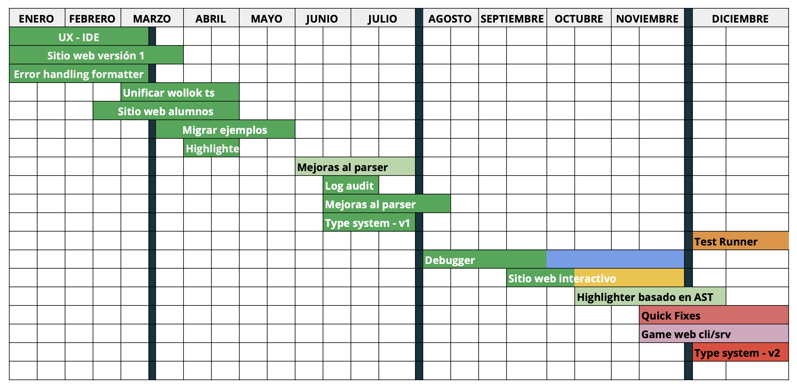

# Wollok Language

This is the repository for the **Wollok Language definition**, and also the main access point for all resources.

## ❓ What is Wollok?

Wollok is a language designed to satisfy our main goals for teaching OO concepts. You can see [Wollok site](https://www.wollok.org) for further information.

## 📋 About this repository

It is a Wollok Project which contains

- Wollok core libraries: strings, numbers, dates, booleans, etc. in `src` folder
- Wollok language specification, in form of unit tests: in `test` folder you'll see our **sanity tests** where you can check how should you use Wollok objects from core libraries, and syntax definitions.

All files follow a [standard coding convention](https://github.com/uqbar-project/wollok-language/wiki/Coding-Standards-for-writing-this-repository), please read them before collaborating.

## 🆕 Changes

- If you want to propose a change, please [open a new issue](/issues/new). Ideally, a new feature proposal should have: a) what do you want to achieve, b) why do you want the new feature, c) (optional) if it could solved with Wollok-side implementation or it could require native implementations, d) (optional, nice-to-have) acceptance tests. We have a sort of _consensus_ instead of a bureaucratic committee, and will evaluate and prioritize the proposal. Pending task: [add a template](https://help.github.com/es/github/building-a-strong-community/configuring-issue-templates-for-your-repository)
- Once approved, we should add it to the [changelog file](CHANGELOG.md), which could also be useful in case you need to migrate your examples according to different versions.

## 🔨 Current work

- [Wollok Roadmap for 2024](https://docs.google.com/spreadsheets/d/1SAmnsdYvkrx_Yby_zP3MyGB_IPT1kzITSQGCCIwqSvc/edit#gid=0)

## ✨ Another useful repositories

- [wollok-ts](https://github.com/uqbar-project/wollok-ts): next generation interpreter Typescript-based, which has...
  - [wollok-ts-cli](https://github.com/uqbar-project/wollok-ts-cli): Wollok Command Line Interface for running programs, a REPL, tests, dynamic diagram using Wollok TS implementation
  - [wollok-lsp-ide](https://github.com/uqbar-project/wollok-lsp-ide): A Work-in-Progress implementation of Language Server Protocol, supported for a lot of IDEs (especially Visual Studio Code)
  - [wollok-run-client](https://github.com/uqbar-project/wollok-run-client): A proof of concept using Wollok Game, first prototype of a dynamic diagram, a new console REPL and wollok-ts interpreter. It will be deprecated hopefully for 2025.
- [wollok-highlight-vscode](https://github.com/uqbar-project/wollok-highlight-vscode), a highlighter plugin for Visual Studio Code
- [wollok-mobile](https://github.com/uqbar-project/wollok-mobile): Mobile implementation for Wollok
- [official web site](https://github.com/uqbar-project/website-wollok-ts): Main content of our Wollok-TS site (developed with [Astro](https://astro.build/))

## 🕸️ Deprecated repositories

These projects are in low-maintenance mode:

- [wollok-xtext](https://github.com/uqbar-project/wollok): it was our first & stable implementation (2016-2024), based on [Eclipse Xtext](https://eclipse.dev/Xtext/).
- [wollok-cli](https://github.com/uqbar-project/wollok-cli): Wollok CLI for tasks automation (CI integration, bash scripting, etc.) using Wollok Xtext implementation
- [old web site](https://github.com/uqbar-project/wollok-site): Main content of our Wollok Xtext site (hosted in github pages using [Jekyll](https://jekyllrb.com/))

## 🧪 Experimental tools for Wollok

We also have several ideas currently suspended, that eventually anybody could resume at any time:

- [Woblocks](https://github.com/alejandroFerrante/Woblocks): a Wollok blockly editor for Wollok Game
- [wollok-game-web](https://github.com/uqbar-project/wollok-game-web): Wollok Game implementation for web browsers.
- [wollok-s](https://github.com/uqbar-project/wollok-s): Wollok Scala interpreter & parser
- [wollok-js](https://github.com/uqbar-project/wollok-js): Wollok javascript interpreter, parser & linker
- [wollok-blockly](https://github.com/uqbar-project/wollok-blockly): a first Wollok blockly editor
- [wollok-sublime](https://github.com/uqbar-project/wollok-sublime): a highlighting extension for [Sublime editor](https://www.sublimetext.com/)
- [wollok-sublime-linter](https://github.com/uqbar-project/wollok-sublime-linter): A Linter for [Sublime 3](https://www.sublimetext.com/)

## 👩‍💻 Contributing

All contributions are welcome!

- Open an issue [here](https://github.com/uqbar-project/wollok-language/issues), and we will contact you!

If you are willing to install the developing environment,
- See [installation instructions for developers](https://github.com/uqbar-project/wollok-language/wiki/Development-Environment)
- You can also [join the Discord channel!](https://discord.gg/ZstgCPKEaa)
- There's a list of [good first issues](https://github.com/uqbar-project/wollok-language/issues?q=is%3Aissue+is%3Aopen+label%3A%22good+first+issue%22) to tackle, but in case of any hesitation you can always ping @PalumboN or @fdodino
- You can fork the project and [create a *Pull Request*](https://help.github.com/articles/creating-a-pull-request-from-a-fork/). If you've never collaborated with an open source project before, you might want to read [this guide](https://akrabat.com/the-beginners-guide-to-contributing-to-a-github-project/)
- Additional info is available at the [wiki](https://github.com/uqbar-project/wollok-ts-cli/wiki)

__Powered by [Uqbar](https://uqbar.org/)__

